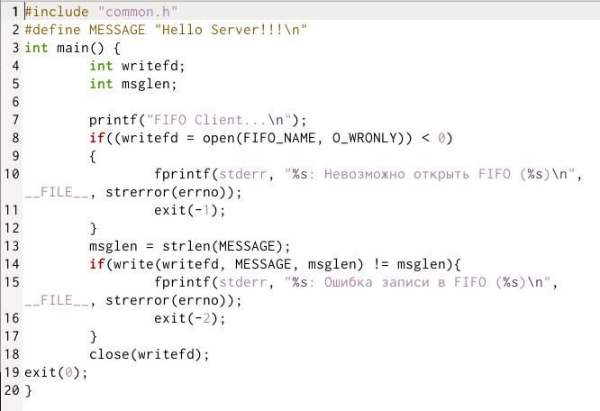

---
## Front matter
lang: ru-RU
title: Лаборатонная Работа № 15 
author: |
	Yassin mohamad alamin
institute: |
	Российский Университет Дужбы Народов
date: Москва, 2021

## Formatting
toc: false
slide_level: 2
theme: metropolis
header-includes: 
 - \metroset{progressbar=frametitle,sectionpage=progressbar,numbering=fraction}
 - '\makeatletter'
 - '\beamer@ignorenonframefalse'
 - '\makeatother'
aspectratio: 43
section-titles: true
---

# Операционные Системы

## Цель Работы

Приобретение практических навыков работы с именованными каналами.

## Задачи

Изучите приведённые в тексте программы server.c и client.c. Взяв данные
примеры за образец, напишите аналогичные программы, внеся следующие изменения:

1. Работает не 1 клиент, а несколько (например, два).

2. Клиенты передают текущее время с некоторой периодичностью (например, раз
в пять секунд). Используйте функцию sleep() для приостановки работы клиента.

## Выполнение Работы

1- 

2- 

3- 

## Вывод

В результате работы , я приобрел практические навыки работы с именованными каналами

# Спасибо за внимание